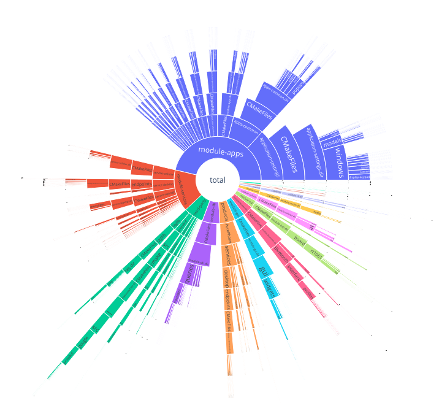

Short script to visualise builds with sunburst
===============================================

**TL;DR;**
short python script to show times logged by `ninja` as sunburst chart

Sunburst chart enables comparison of groups of elements on the same depth quickly and visualizes how big is each group.
Use of sunburst chart is my favorite feature of baobab [disk usage analyzer](https://www.wikiwand.com/en/Disk_Usage_Analyzer). I thought it would be pretty great to have such tool for build times.

## how to use

- use ninja to compile your project, it's possible to get compilation times from make, but it required single thread compilation when I last checked
- copy .ninja_log and pass it through the: [ninjatracing](https://github.com/nico/ninjatracing) this will enable you to
    - use speedscope utility in that repo link
    - continue with what we do here :) 
- run ninja_time_analysis.py --file filename.json to show pretty plotly sunburst chart

enjoy :) 
